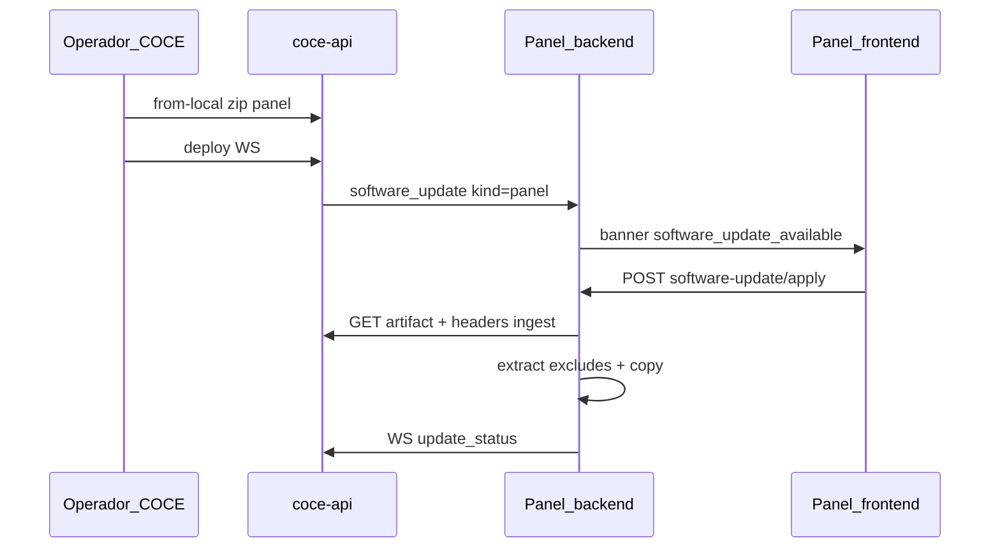

# Actualizaciones remotas COCE → sucursales

Documento para desarrollo / handoff. Rama de trabajo: `feat/remote-updates`.

## Objetivo

Distribuir desde el **COCE** (única IP conocida) actualizaciones a las sucursales **sin** que las PCs de oficina tengan acceso a GitHub ni hagan `git pull`.

Hay dos tipos de release:

| Tipo | `kind` | Qué actualiza | Qué hace el operador en sucursal |
|------|--------|---------------|----------------------------------|
| Panel PC | `panel` | Backend + frontend del software de puertas | Banner → **Actualizar panel** → reiniciar servicio |
| APK tablet | `tablet_apk` | APK Android (Akuvox) | Banner → **Descargar APK** → instalar a mano con software Akuvox |

La APK **no** va al repositorio git: se sube como fichero al disco del COCE.

---

## Arquitectura (visión general)

```
                    ┌─────────────────┐
  git pull manual   │  PC del COCE    │
  / build APK  ───► │  coce-api +     │
                    │  dashboard      │
                    └────────┬────────┘
                             │ WebSocket software_update
                             │ (mismo canal que mensajes)
              ┌──────────────┼──────────────┐
              ▼              ▼              ▼
         Sucursal A     Sucursal B     Sucursal N
         panel backend  …              …
              │
              ├─ kind=panel  → apply zip (excluye data/BD/.env)
              └─ kind=tablet_apk → descarga APK en el PC del panel
```

Las sucursales **ya** mantienen WS hacia el COCE (heartbeats, modos, etc.). El aviso de update usa ese canal; el artefacto se descarga por HTTP autenticado.

---

## Flujo A — Panel (front + back de puertas)

### En el COCE

1. En la máquina COCE: `git pull` del checkout del panel (manual).
2. Opcional: `npm run build` en `frontend/` para generar `frontend/dist`.
3. Configurar env del API:
   ```env
   COCE_PANEL_SOURCE_DIR=C:/ruta/al/repo/santander
   ```
4. Dashboard COCE → **Actualizaciones remotas** → **Publicar desde local**.
   - Empaqueta `backend/` + `frontend/dist` (o `frontend/` si no hay dist).
   - **Excluye**: `data/`, `*.db`, `.env`, `node_modules/`, `.git`, etc.
5. Seleccionar el release → **Lanzar despliegue** (todas o sucursales concretas).

### En la sucursal

1. Banner superior: `Actualización panel X.Y`.
2. Botón **Actualizar panel** → `POST /api/panel/software-update/apply`.
3. El backend descarga el zip del COCE, verifica SHA-256, copia código y **no toca** BD/configs locales.
4. Mensaje: reiniciar el servicio Windows del panel y recargar el navegador para ver el front nuevo.
5. La sucursal reporta `update_status` al COCE por WS.

### Diagrama secuencia (panel)



---

## Flujo B — APK (tablets Akuvox)

1. Compilar y firmar la APK **fuera** del repo (proceso actual).
2. COCE → Actualizaciones → formulario:
   - Versión (obligatoria, ej. `2.8.1`)
   - Archivo `.apk`
   - Notas (opcional)
3. **Subir APK** → se guarda en `coce-api/data/releases/` (gitignored).
4. **Lanzar despliegue** con ese release (`kind=tablet_apk`).
5. En sucursal: banner `Nueva APK tablet X.Y` → **Descargar APK**.
6. El responsable instala en las tablets con **Akuvox** (no hay sideload silencioso ni store).

La tablet **no** descarga del COCE. Solo el panel de la sucursal.

---

## Contrato WebSocket

### COCE → sucursal

```json
{
  "type": "software_update",
  "payload": {
    "release_id": "uuid",
    "version": "1.4.2",
    "kind": "panel",
    "download_path": "/api/coce/updates/releases/{id}/artifact",
    "sha256": "...",
    "published_at": "ISO-8601",
    "changelog": "...",
    "mandatory": false,
    "deployment_id": "uuid"
  }
}
```

`kind` también puede ser `"tablet_apk"`.

### Sucursal → COCE

```json
{
  "type": "update_status",
  "payload": {
    "release_id": "uuid",
    "status": "available|downloading|applying|success|failed|offline",
    "version": "1.4.2",
    "error": null
  }
}
```

---

## API COCE (`/api/coce/updates`)

| Método | Ruta | Auth | Uso |
|--------|------|------|-----|
| GET | `/releases` | JWT dashboard | Listar releases |
| POST | `/releases` | JWT + multipart | Subir APK o zip (`kind`, `version`, `file`, `changelog`) |
| POST | `/releases/from-local` | JWT | Empaquetar desde `COCE_PANEL_SOURCE_DIR` |
| GET | `/releases/{id}/artifact` | JWT **o** headers sucursal | Descargar artefacto |
| POST | `/deploy` | JWT | `{ releaseId, branchIds[], sendToAll }` → WS |
| GET | `/deployments` | JWT | Cola de estados por sucursal |

Descarga desde sucursal (headers):

- `X-Coce-Ingest-Token`
- `X-Coce-Installation-Id`

---

## API panel sucursal (`/api/panel`)

| Método | Ruta | Uso |
|--------|------|-----|
| GET | `/software-update` | Estado + `pending` |
| POST | `/software-update/apply` | Aplicar update `kind=panel` |
| GET | `/software-update/apk` | Descargar APK pendiente |
| POST | `/software-update/dismiss` | Cerrar aviso / marcar visto |

---

## Ficheros relevantes (implementación en `feat/remote-updates`)

### COCE

- [`coce-api/app/db/schema.py`](coce-api/app/db/schema.py) — tablas `software_releases`, `software_deployments`
- [`coce-api/app/db/updates_store.py`](coce-api/app/db/updates_store.py)
- [`coce-api/app/api/routes/updates.py`](coce-api/app/api/routes/updates.py)
- [`coce-api/app/services/panel_packager.py`](coce-api/app/services/panel_packager.py)
- [`coce-api/app/services/live_hub.py`](coce-api/app/services/live_hub.py) — ingest `update_status`
- [`coce-dashboard/src/pages/UpdatesDesignPage.tsx`](coce-dashboard/src/pages/UpdatesDesignPage.tsx)
- [`coce-dashboard/src/api/coceClient.ts`](coce-dashboard/src/api/coceClient.ts)

### Panel sucursal

- [`backend/app/coce/dispatcher.py`](backend/app/coce/dispatcher.py) — `software_update`
- [`backend/app/db/software_update_store.py`](backend/app/db/software_update_store.py)
- [`backend/app/services/software_updater.py`](backend/app/services/software_updater.py)
- [`backend/app/api/routes/panel.py`](backend/app/api/routes/panel.py) — endpoints software-update
- [`frontend/src/components/SoftwareUpdateBanner.jsx`](frontend/src/components/SoftwareUpdateBanner.jsx)
- [`frontend/src/ETD8A12Panel.jsx`](frontend/src/ETD8A12Panel.jsx) — WS → banner

### Config

- `coce-api/.env`: `COCE_PANEL_SOURCE_DIR`, `COCE_UPDATES_MAX_UPLOAD_MB`
- Panel: `COCE_WS_URL`, `COCE_INSTALLATION_ID`, `COCE_INGEST_TOKEN` (ya usados para el WS)

---

## Excludes al empaquetar / aplicar panel

No se sobrescriben (ni se incluyen en el zip cuando aplica):

- `data/`, `*.db`, `*.sqlite*`
- `.env`, `.env.*`
- `node_modules/`, `.git/`, venv, `__pycache__`
- JSON/configs locales que vivan bajo `data/`

---

## Cómo probar (checklist)

1. Arrancar `coce-api` y dashboard; panel sucursal con WS COCE conectado.
2. **APK**: subir `.apk` + versión → desplegar → banner en panel → Descargar APK.
3. **Panel**: `COCE_PANEL_SOURCE_DIR` correcto → Publicar desde local → desplegar → Actualizar panel → reiniciar servicio → verificar front/back.
4. En dashboard, revisar cola de despliegues (`available` / `success` / `offline` / `failed`).

---

## Fuera de v1 (no implementar aún)

- GitHub Actions obligatorio (queda opcional; mismo contrato de release).
- `git pull` en oficinas.
- Descarga/instalación APK iniciada desde la tablet.
- OTA silenciosa / Device Owner en Akuvox.
- Lectura automática de `versionCode` del APK (ahora la versión la escribe el operador).
- Auto-apply sin confirmación en sucursal.

---

## Decisiones de producto (recordatorio)

- Origen preferente del panel: **manual en COCE** (menos intrusivo que Action → N IPs).
- Confirmación **manual** en banner de sucursal.
- Tablets: marca real **Akuvox**; instalación con su software WiFi/formulario.
- Front del panel: no hot-reload remoto; tras apply hace falta **reinicio del servicio** + recarga del navegador.
